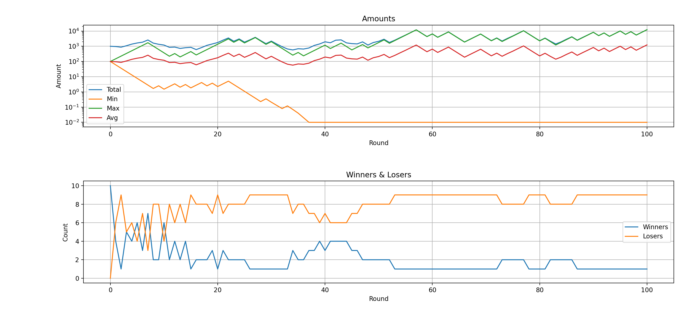

# Simple Coin Gamble
Simulator for a simple coins gamble.
This gamble is inspired by the book "Gier" from Marc Elsbeg.

This book itself was inspired by the work of the London Mathematical Laboratory and its research on ergodicity economics.

## The Rules
There are multiple players and a coin.
Each player starts with an initial bet of 100 units (Euros or Dollars).
Each round the players toss the coins.
If it shows heads the player wins 50% of its units.
If it shows tails the player lose 40% of its units.

## Sample
The picture below shows an example result for a gamble with 10 players over 100 rounds.

It shows that after 100 rounds there is only one winner having a lot of money.
All the other players lost their initial bet.

