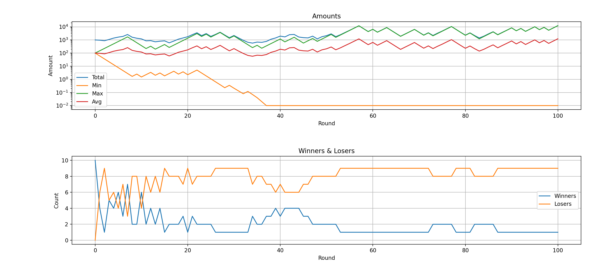
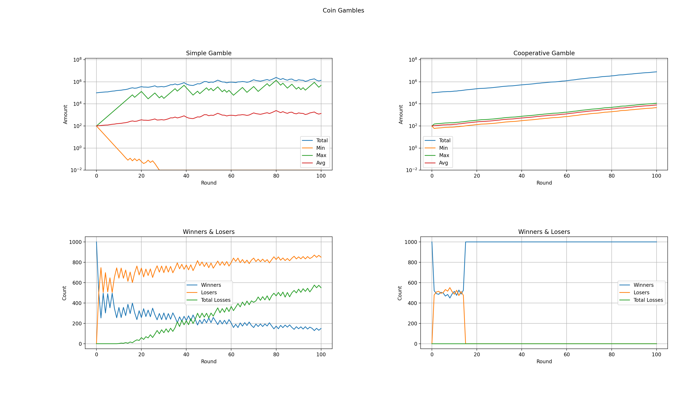

# Simple Coin Gamble
Simulator for a simple coins gamble.
This gamble is inspired by the book "Gier" from Marc Elsbeg.

This book itself was inspired by the work of the London Mathematical Laboratory and its research on ergodicity economics.

## Rules
### Simple Gambling
There are multiple players and a coin.
Each player starts with an initial bet of 100 units (Euros or Dollars).
Each round the players toss the coins.

If it shows heads the player wins 50% of its units.
If it shows tails the player lose 40% of its units.

If the amount of a player drops below 1% of its initial bet, it is treated as a total loss.

### Cooperative Gambling
The rules for cooperative gambling are the same as for simple gambling.
Except, before each round the total amount (minus a coordination fee) is distributed to all players.

## Examples

### Simple Gambling

```
$ python3 coingamble.py --players 10 --round 100 --bet 100 simple
```

The picture below shows an example result for a gamble (simple gambling rules) with 10 players over 100 rounds.

It shows that after 100 rounds there is only one winner having a lot of money.
All the other players lost their initial bet.



### Cooperative Gambling

```
$ python3 coingamble.py --players 1000 --round 100 --bet 100 --coordination-fee 0.5 simple cooperative
```

The picture below shows an exmple result for comparing the simple vs. cooperative gamble.
For both, 1000 players gambling for 100 rounds with an initial bet of 100.

There is a coordination fee of 0.5% for the cooperative gamble.



